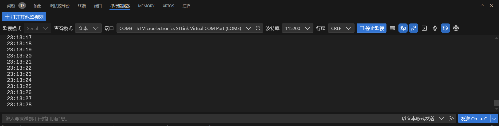

# Vscode + EIDE + HAL库开发流程讲解

author: PCH  
email: <pch@pch.pub>

## 目录

0. [简介](#简介)
1. [准备需要的材料](#1-准备需要的材料)
2. [搭建环境](#2-搭建环境)
3. [使用 STM32CubeMX 生成代码](#3-使用-stm32cubemx-生成代码)
4. [使用 HAL 库开发（以点灯为例）](#4-使用-hal-库开发以点灯为例)
5. [编译](#5-编译)
6. [烧录](#6-烧录)
7. [调试](#7-调试)
8. [参考资料](#8-参考资料)
9. [附录](#附录)
10. [License](#license)

---

## 简介

本文档主要介绍如何使用 `VSCode`、`STM32CubeCLT`、`STM32CubeMX`、`HAL` 库进行 `STM32` 开发。
VSCode 是一个轻量级的代码编辑器，支持多种语言，支持插件扩展，是一个非常适合嵌入式开发的工具。
STM32CubeCLT 是一个命令行工具，可以用来编译、烧录、调试等。
STM32CubeMX 是一个图形化工具，可以用来配置 `STM32` 芯片的各种参数，生成代码。
HAL 是 `STM32` 官方提供的库，封装了底层的寄存器操作，提供了一些高级的接口，方便开发者使用。

注：本文档面向初学者，不涉及太多细节。更多细节请参考官方文档
下文提到的eide均指EIDE扩展，即Embedded IDE

### 1. 准备需要的材料

- [**VSCode**](https://code.visualstudio.com/download)
- [**STM32CubeCLT**](https://www.st.com.cn/zh/development-tools/stm32cubeclt.html)
- [**STM32CubeMX**](https://www.st.com.cn/zh/development-tools/stm32cubemx.html)
- **开发板**
  - 本例使用的开发板的mcu为 [**STM32F103C8T6**](https://www.st.com.cn/zh/microcontrollers-microprocessors/stm32f103.html)
- JLink/STLink/DAPLink
  - 本例使用的是 [**STLink-V3set**](https://www.st.com.cn/zh/development-tools/stlink-v3set.html)，后文未说明的地方默认使用此工具
  - 注：课上推荐的是 JLink-OB V2，实际应用中应按照调试器的实际情况进行配置
- 一些杜邦线/排线
- 5V电源
- 一台 x86 电脑（ `%USERPROFILE%` 不要带中文）
  
---

### 2. 搭建环境

- **安装 `VSCode`**
- **安装 `STM32CubeCLT`**
  > **注意**
  > 安装路径不能有空格和中文
- **安装 `STM32CubeMX`**
  > **注意**
  > 安装路径不能有空格和中文
- **安装 `VSCode` 扩展：**
  - `C/C++`
  - `Cortex-Debug`
  - `CMake`
  - `CMake Tools`
  - `Embedded IDE`
  - `STM32 VS Code Extension`

---

### 3. 使用 `STM32CubeMX` 生成代码

1. 打开 `STM32CubeMX`。
2. 选择对应的芯片。
3. 配置芯片。
4. 生成代码。

- <details>
   <summary>详细步骤</summary>
      - <div align=left></div>
      - <div align=left></div>
      - <div align=left></div>
      - <div align=left></div>
      - <div align=left></div>
      - <div align=left></div>
      - <div align=left></div>
      - <div align=left></div>
   </details>

---

### 4. 使用 `HAL` 库开发（以点灯为例）

1. 打开 `VSCode`。
   - 启动 `STM32 VS Code Extension`。
   - 配置 `STM32CubeCLT` 路径。
2. 创建项目：
   - 打开 `EIDE`。
   - 选择 `新建项目`。
   - 选择 `空项目`。
   - 选择 `Cortex-M 项目`。
   - 输入项目名称。
   - 切换工作区。
   - 按照教程添加项目资源。
     - 打开eide
     - 点击 `项目资源`, 添加代码所在的文件夹
       - 通常为 `Core` 和 `Drivers` 文件夹
     - 点击`链接脚本路径`, 添加 .ld 文件
     - 点击项目属性 - 包含目录
       - 添加 `Core/Inc` 和 `Drivers/STM32F1xx_HAL_Driver/Inc` 和其它文件夹
       - (所需要添加的文件夹为 `Makefile`文件 中的 `C_INCLUDES` 包含的目录)
     - 点击 预处理宏定义
       - 添加 `STM32F103xB` 和 `USE_HAL_DRIVER` 和其它宏定义
       - (所需要添加的宏定义为 `Makefile` 中的 `C_DEFS` 包含的宏定义 不包含`-D`前缀)
   - 编辑构建配置。
   - 编辑烧录配置。
   - 编辑项目属性。
   - 生成调试配置。
     - 右击EIDE项目名，选择 `生成调试配置`。
     - 下载 [SVD File](https://github.com/modm-io/cmsis-svd-stm32) (比如 STM32F103.svd)
     - 配置 `launch.json` 文件 `Cortex-Debug`选项 的 `svdFile` 键。
     - 注：使用 `JLink` 的话，调试配置请选择 `JLink`/`OpenOCD`。
   - 把 `startup_stm32f103xb.s` 文件移动到 /Core/Src 文件夹下
3. 编写代码。
   - 打开 `Core/Src/main.c`。
   - 编写代码。
   - 示例代码：

      ```c
      // 采用延时的方式实现点灯
      // 其它方式略
      HAL_GPIO_TogglePin(LED_GPIO_Port, LED_Pin);
      HAL_Delay(1000);
      ```

   - 注：代码中的 `LED_GPIO_Port` 和 `LED_Pin` 是 `STM32CubeMX` 自动生成的宏定义。
     代码写在注释对中间，不要覆盖原有代码。

---

### 5. 编译

1. 打开 `VSCode`。
2. 打开工作区。
3. 点击最下方的`Build`按钮。
   - 编译成功后会在工作区的 `build` 文件夹下生成 `.hex` 和 `.elf` 文件。
   - 编译成功示例：

     ```shell
      [ INFO ] start compilation ...
      [ INFO ] start linking ...
      Memory region         Used Size  Region Size  %age Used
                  RAM:        3000 B        20 KB     14.65%
                FLASH:       20324 B        64 KB     31.01%
      [ INFO ] start outputting files ...
      >> output hex file              [done]
      file path: "build/Debug/stm32_testboard.hex"
      >> output bin file              [done]
      file path: "build/Debug/stm32_testboard.bin"
      [ DONE ] build successfully !, elapsed time 0:0:0
      - 终端将被任务重用，按任意键关闭。
     ```

   - 注：如果编译失败，可以查看错误信息，在 `VSCode` 中也会指明错误的位置。
   - stm32cubemx 6.12.1 有bug，链接文件缺少RAM区域，需要手动更改，具体操作请查看[这里](https://community.st.com/t5/stm32cubemx-mcus/flash-ld-syntax-error-when-upgrading-to-cubemx-v6-12-1/m-p/725646/highlight/true#M29630)

---

### 6. 烧录

1. 打开 `VSCode`。
2. 打开工作区。
3. 连接开发板。
   - <div align=left></div>

     以 STLink-V3set SWD 接线为例:

     | 调试器       | 开发板 |
     | ------------ | ------ |
     | T_VCC        | 3.3V   |
     | JTMS         | SWCLK  |
     | JTDI         | SWDIO  |
     | GND          | GND    |
     | NRST(非必须) | NRST   |

   - 打开电源开关。
4. 点击最下方的烧录按钮。
   - 
   - 烧录成功示例：

     ```shell
      Erasing memory corresponding to segment 0:
      Erasing internal memory sectors [0 19]
      Download in Progress:
      ██████████████████████████████████████████████████ 100%
      File download complete
      Time elapsed during download operation: 00:00:01.267
      Verifying ...
      Read progress:
      ██████████████████████████████████████████████████ 100%
      Download verified successfully
      RUNNING Program ...
        Address:      : 0x8000000
      Application is running, Please Hold on...
      Start operation achieved successfully
     ```

   - 注：如果使用的是 `STLink-V3set`，也可以用拖拽的方式烧录（STLink会在电脑中显示一个磁盘）。此方法不常用，通常只是在其它地方方便演示。
   - 如果用的 `jlinkob` ,那么需要在`EIDE`中点击 `安装实用工具` -> `JLink` -> `安装`，然后在`EIDE`中点击 `烧录` -> `JLink` -> `烧录`，即可烧录

---

### 7. 调试

1. 打开 `VSCode`。
2. 连接开发板。
3. 设置断点。
4. 运行和调试(下方工具条/Ctrl+Shift+D)。
5. 可进行单步调试、查看变量、查看寄存器等。
6. (可选) 使用串口输出调试信息。
   - 下载 `VSCode` 扩展 `Serial Monitor`
   - 在 `STM32CubeMX` 中开启 `USART`。
   - 将 `USART` 引脚连接到调试器。
   - <div align=left></div>
  
   > **注意**  
   > 如果用的STLink-V3set,则需要将开发板的 `USART` 的 `TX` 和 `RX` 引脚连接到 `STLink` 的 `TX` 和 `RX`。  
   > 即 `USART1_TX` 连接到 `TX`，`USART1_RX` 连接到 `RX`。  
   > 这不是编写错误，更多信息请查询 [STLink-V3set 用户手册](https://www.st.com/resource/en/user_manual/um2448-stlinkv3set-debuggerprogrammer-for-stm8-and-stm32-stmicroelectronics.pdf)。

   - 在代码中使用 `HAL_UART_Transmit` 或 `HAL_UART_Transmit_IT` 进行输出。
   - 输入同理，略。
   - 在 `VSCode` 中打开串口监视器。
7. (可选) 使用 `SWO` 输出调试信息。
    - 在 `STM32CubeMX` 中开启 `SWO`。
    - 将 `SWO` 引脚连接到调试器。
    - 在 `VSCode` 中配置 `SWO`。
    - 在代码中使用 `printf`。

---

### 8. 参考资料

1. HAL 库官方文档目录：`%USERPROFILE%\STM32Cube\Repository\STM32Cube_FW_F1_V1.8.6\Drivers\STM32F1xx_HAL_Driver\STM32F103xB_User_Manual.chm`  
   (以实际路径为准)
2. [STLink-V3set 用户手册](https://www.st.com/resource/en/user_manual/um2448-stlinkv3set-debuggerprogrammer-for-stm8-and-stm32-stmicroelectronics.pdf)

---

## 附录

pdf 版本请查看 [这里](https://github.com/pchpub/stm32-vscode-tutorials/actions)。

## License

本文档遵循
[Apache License 2.0](https://github.com/pchpub/stm32-vscode-tutorials/blob/main/LICENSE)

<!-- by PCH pch@pch.pub -->